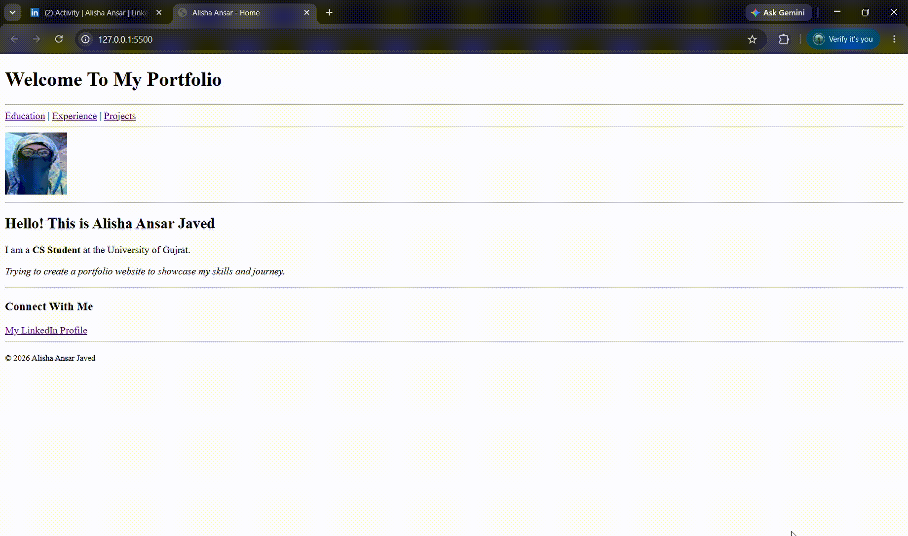

# My Personal Portfolio Website 🚀

A simple practice project built as part of my learning journey.

# Project Demo

## 📌 About This Project
This is a personal portfolio website developed as part of my computer science studies at the **University of Gujrat**. It showcases my educational background, professional experience, and practice projects.

---

## 📂 Features & Pages
* **`index.html`**: The home page providing a general introduction.
* **`education.html`**: Highlights my academic journey and qualifications.
* **`experience.html`**: Details my professional experience and background.
* **`projects.html`**: Displays the key practice projects I have worked on.

---

## 🛠️ Technologies Used
* **HTML5**
* **CSS3**

---

## 👤 Author
* **Alisha Ansar** (D/O Ansar Javed)  
* **University of Gujrat**
